# คู่มือการใช้งาน — ระบบลบบัญชี (PBI-16)

**ระบบ:** ไปนำแหน่
**เวอร์ชัน:** 1.2
**ผู้ใช้งาน:** User (Passenger/Driver), Admin

---

## 0. UI ภาพรวม

ระบบลบบัญชีของไปนำแหน่ประกอบด้วย 3 ส่วนหลัก ได้แก่ ฝั่ง User ที่ขอลบบัญชี ฝั่ง Admin ที่อนุมัติหรือปฏิเสธ และหน้าแจ้งสถานะเมื่อ Login ขณะบัญชีอยู่ระหว่างรอลบ

### 0.1 หน้าโปรไฟล์ — ปุ่มลบบัญชี (User)
ปุ่ม **ลบบัญชี** (สีแดง) อยู่ที่ด้านล่างสุดของหน้าโปรไฟล์

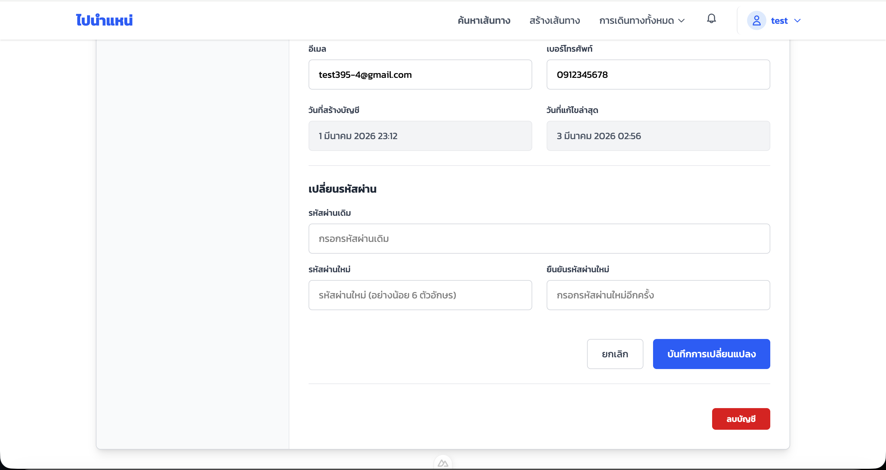

---

### 0.2 ฟอร์มขอลบบัญชี (User)
User ระบุเหตุผล กรอกรหัสผ่านยืนยัน และยอมรับเงื่อนไขก่อนส่งคำขอ

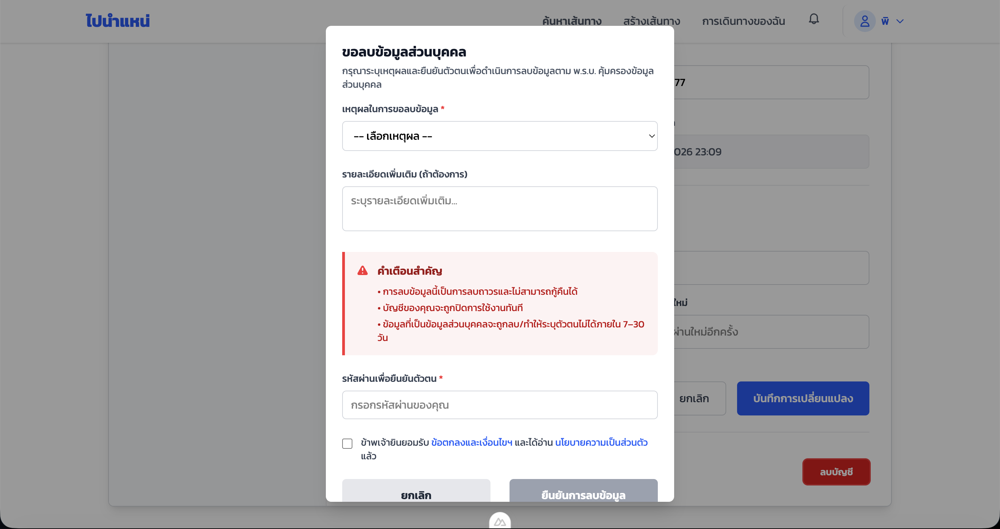

---

### 0.3 หน้า Login — บัญชีอยู่ระหว่างรอลบ (User)
เมื่อ Login ขณะบัญชีอยู่ระหว่างรอลบ ระบบแสดงหน้านี้พร้อมตัวเลือกยกเลิกหรือออกจากระบบ

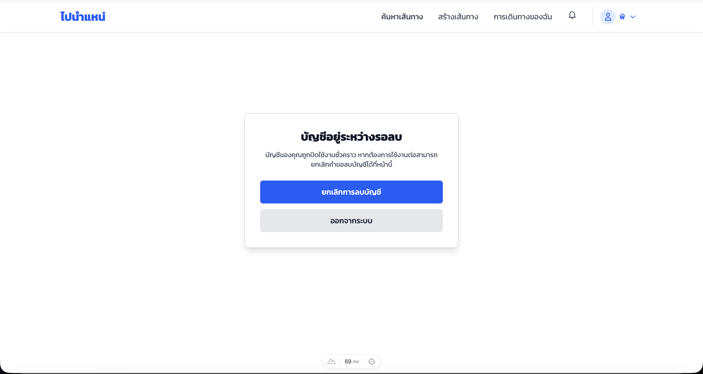

---

### 0.4 หน้า All Requests (Admin)
Admin เห็นรายการคำขอลบบัญชีทั้งหมด กรองตามสถานะและบทบาทได้

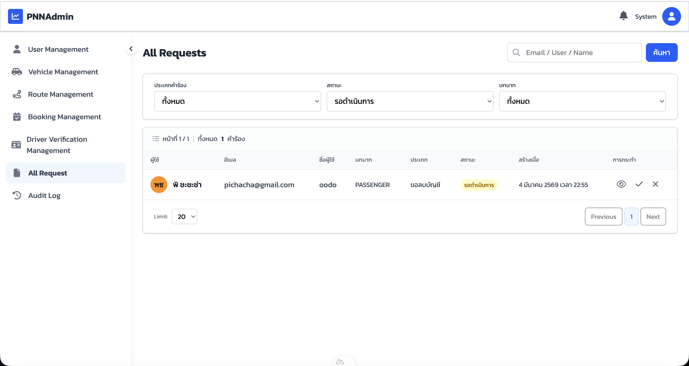

---

### 0.5 หน้ารายละเอียดคำร้อง (Admin)
Admin ดูข้อมูลผู้ใช้ เหตุผล และ Backup ข้อมูลของผู้ขอลบบัญชี

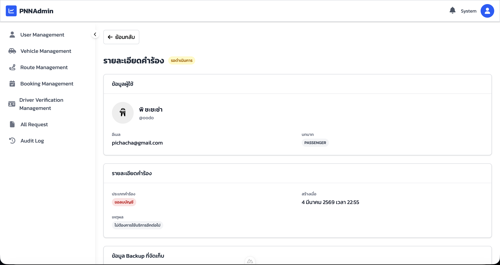

---

### 0.6 Dialog อนุมัติคำร้อง (Admin)
Admin ยืนยันการอนุมัติ ระบบจะแจ้งผู้ใช้ทางอีเมลและเริ่มนับถอยหลังลบข้อมูล

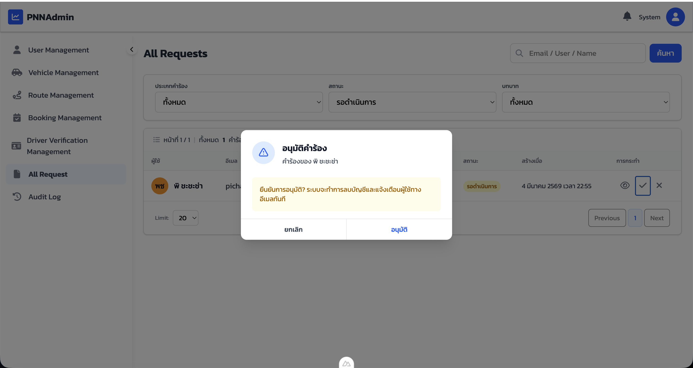

---

### 0.7 Dialog ปฏิเสธคำร้อง (Admin)
Admin ระบุหมายเหตุก่อนกดปฏิเสธคำขอลบบัญชี

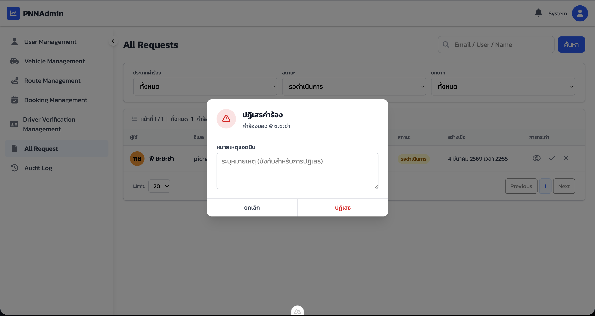

---

### 0.8 หน้า Audit Log (Admin)
บันทึกประวัติทุก Event ของการลบบัญชี ตั้งแต่ขอลบ อนุมัติ ปฏิเสธ จนถึงลบสำเร็จ

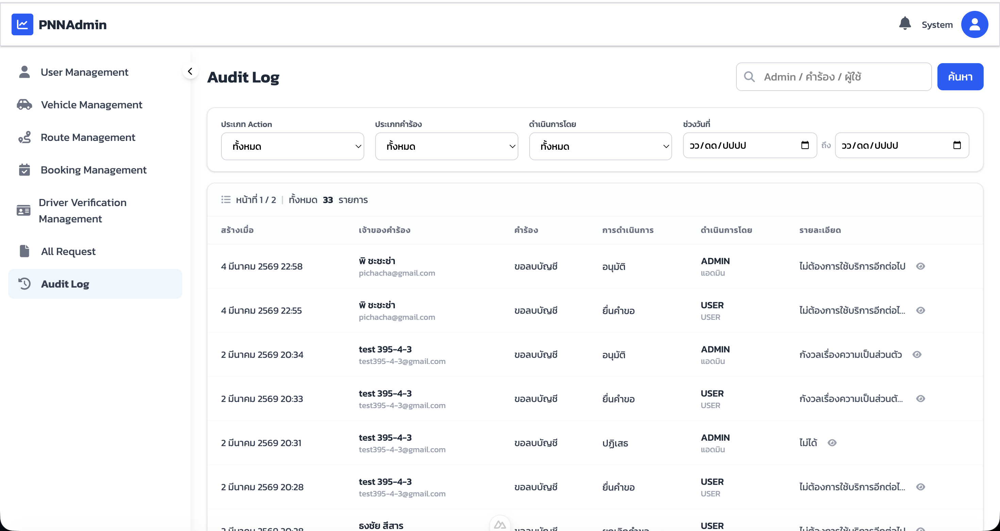

---

## 1. ขั้นตอนการใช้งาน

---

### ส่วนที่ 1: User ขอลบบัญชี

| ขั้นตอน | การกระทำ |
|---------|---------|
| 1 | เข้าสู่ระบบ แล้วไปที่เมนู **โปรไฟล์** |
| 2 | เลื่อนลงมาด้านล่างสุด กดปุ่ม **ลบบัญชี** (สีแดง) |
| 3 | ฟอร์ม "ขอลบข้อมูลส่วนบุคคล" เปิดขึ้น |
| 4 | เลือก **เหตุผลในการขอลบข้อมูล** จาก dropdown |
| 5 | กรอก **รายละเอียดเพิ่มเติม** (ถ้ามี) |
| 6 | กรอก **รหัสผ่าน** เพื่อยืนยันตัวตน |
| 7 | ติ๊ก checkbox ยืนยันว่าได้อ่านข้อตกลงแล้ว |
| 8 | กดปุ่ม **ยืนยันการลบข้อมูล** |
| 9 | ระบบส่งคำขอไปยัง Admin และ Logout อัตโนมัติ |

> **คำเตือน:** การลบบัญชีไม่สามารถกู้คืนได้ และข้อมูลจะถูกลบภายใน 7–30 วันหลังได้รับการอนุมัติ

---

### ส่วนที่ 2: User ยกเลิกคำขอลบบัญชี

| ขั้นตอน | การกระทำ |
|---------|---------|
| 1 | Login เข้าสู่ระบบ |
| 2 | ระบบแสดงหน้า **"บัญชีอยู่ระหว่างรอลบ"** |
| 3 | กดปุ่ม **ยกเลิกการลบบัญชี** |
| 4 | ระบบยกเลิกคำขอและคืนสิทธิ์การใช้งานปกติ |

---

### ส่วนที่ 3: Admin จัดการคำขอลบบัญชี

#### 3.1 ดูรายการคำขอ

| ขั้นตอน | การกระทำ |
|---------|---------|
| 1 | Login เข้า Admin Panel (PNNAdmin) |
| 2 | เลือกเมนู **All Request** ในแถบด้านซ้าย |
| 3 | กรองรายการด้วย ประเภทคำร้อง / สถานะ / บทบาท ตามต้องการ |
| 4 | กดไอคอน **ดู** (รูปตา) เพื่อดูรายละเอียดคำร้อง |

#### 3.2 อนุมัติคำขอ

| ขั้นตอน | การกระทำ |
|---------|---------|
| 1 | กดไอคอน **ถูก** (✓) ในแถวของผู้ใช้ที่ต้องการอนุมัติ |
| 2 | Dialog "อนุมัติคำร้อง" เปิดขึ้น แสดงชื่อผู้ใช้และคำเตือน |
| 3 | กดปุ่ม **อนุมัติ** |
| 4 | ระบบส่งอีเมลแจ้งผู้ใช้ และเริ่มกระบวนการลบข้อมูลตามกำหนด |

#### 3.3 ปฏิเสธคำขอ

| ขั้นตอน | การกระทำ |
|---------|---------|
| 1 | กดไอคอน **X** ในแถวของผู้ใช้ที่ต้องการปฏิเสธ |
| 2 | Dialog "ปฏิเสธคำร้อง" เปิดขึ้น |
| 3 | กรอก **หมายเหตุ** เพื่อแจ้งเหตุผลแก่ผู้ใช้ |
| 4 | กดปุ่ม **ปฏิเสธ** |
| 5 | ระบบแจ้งผู้ใช้ว่าคำขอถูกปฏิเสธพร้อมเหตุผล |

---

### ส่วนที่ 4: Admin ดู Audit Log

| ขั้นตอน | การกระทำ |
|---------|---------|
| 1 | เลือกเมนู **Audit Log** ในแถบด้านซ้าย |
| 2 | กรองด้วย ประเภท Action / ประเภทคำร้อง / ดำเนินการโดย / ช่วงวันที่ |
| 3 | Audit Log แสดงประวัติทุก Event ได้แก่ ขอลบ, ยืนยัน, อนุมัติ, ปฏิเสธ, ลบสำเร็จ |

---

### สรุปสถานะคำขอลบบัญชี

| สถานะ | ความหมาย |
|-------|---------|
| PENDING | รอ Admin พิจารณา |
| APPROVED | อนุมัติแล้ว รอครบกำหนดลบ |
| REJECTED | ปฏิเสธคำขอ บัญชียังใช้งานได้ปกติ |
| CANCELLED | User ยกเลิกคำขอเอง |
| DELETED | ลบข้อมูลเรียบร้อยแล้ว |

---

## 2. คำชี้แจงการใช้ AI (PBI-16)

ทีมพัฒนา PBI-16 มีการใช้เครื่องมือ AI เพื่อสนับสนุนกระบวนการพัฒนาระบบลบบัญชี โดยมีรายละเอียดดังนี้

| ชื่อ | ใช้ AI ตัวไหน | ใช้ในขั้นตอนไหน | ใช้เพื่ออะไร | ระดับ |
|---------|--------------|----------------|-------------|-------|
| pichamon395-4 | ChatGPT และ Claude | วิเคราะห์และออกแบบ Database Schema, ออกแบบ Audit Log ให้สอดคล้อง PDPA, ตรวจสอบ Prisma schema และ Vue UI binding error, แนะนำการแก้ไข bug, อธิบายแนวคิด Soft Delete / Cron Job / Data Retention, ปรับปรุงข้อความ, วิเคราะห์ปัญหา Script | ได้รับคำแนะนำทางเทคนิค ช่วยตรวจสอบ schema และ logic ช่วยเข้าใจข้อกำหนด PDPA และสร้าง Test Script | 2 |
| Thongchai595-6 | ChatGPT 5.2 | ศึกษาแนวทางออกแบบระบบตาม PDPA, ออกแบบโครงสร้างระบบและฐานข้อมูล, ตรวจสอบตรรกะและข้อผิดพลาดเบื้องต้นของโค้ด | อธิบายแนวคิดทางเทคนิค เสนอแนะโครงสร้างตามมาตรฐาน ตรวจสอบ logic ของโค้ด | 2 |
| Ammika356-3 | ไม่ได้ใช้ | — | — | — |
| Bunyasak604-1 | ChatGPT (GPT-5) | จัดทำเอกสารและจัดรูปแบบ Change Log | จัดหมวดหมู่ Added/Changed/Fixed ลบข้อความซ้ำ ปรับรูปแบบให้อ่านง่ายและเป็นมาตรฐาน | 2 |
| Kittikorn587-5 | Gemini | ค้นหาวิธีการส่ง Email แจ้งเตือน, วิเคราะห์ปัญหาการทำงานของระบบ | วิเคราะห์ API และ Schema วิเคราะห์ Error log และแนะนำแนวทางแก้ไข | 2 |
| Jularat387-4 | Gemini | หาข้อมูลและอธิบายโค้ด, วางโครงสร้าง Docker, ค้นหาและแก้ไข Bug, เขียน README | ศึกษา Docker และ Dockerfile ค้นหา Bug ฝั่ง Backend วางโครงสร้าง Server เขียน README | 2 |
| Siwawit402-3 | ChatGPT 5.1 | จัดเตรียมโครงสร้างฐานข้อมูลเบื้องต้น ตรวจสอบความสัมพันธ์ของตาราง | ตรวจสอบความสอดคล้องของโครงสร้างข้อมูลในระดับ PDPA ลดข้อผิดพลาดด้านความสัมพันธ์ข้อมูล | 1 |

---

---

# คู่มือการใช้งาน — ระบบชำระเงิน (PBI-Bonus)

**ระบบ:** ไปนำแหน่
**เวอร์ชัน:** 1.2
**ผู้ใช้งาน:** Passenger (ผู้โดยสาร), Driver (คนขับ)

---

## 0. UI ภาพรวม

ระบบชำระเงินของไปนำแหน่รองรับ 2 วิธีหลัก ได้แก่ การโอนเงิน (PromptPay) และเงินสด โดย Driver ตั้งค่าข้อมูลรับเงินไว้ล่วงหน้า และ Passenger ชำระเงินหลังเดินทางถึงปลายทาง

---

### 0.1 หน้าข้อมูลการรับเงิน (Driver — Payment Info)
Driver ตั้งค่า PromptPay ID และบัญชีธนาคารสำหรับรับเงิน

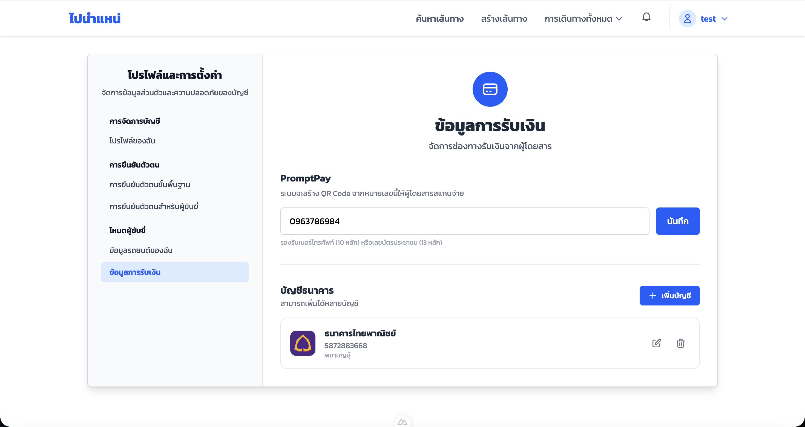

---

### 0.2 หน้า My Route (Driver)
Driver เห็นสถานะการเดินทางและสามารถกดปุ่ม **ถึงที่หมายแล้ว** เพื่อเริ่มกระบวนการชำระเงิน

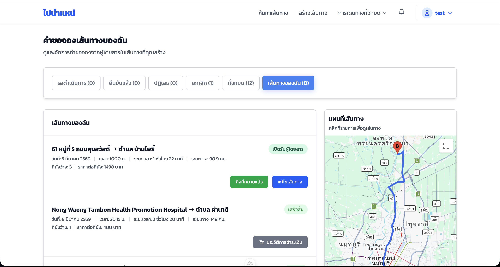

---

### 0.3 หน้า My Route (Passenger)
Passenger เห็นสถานะการเดินทางและปุ่ม **ชำระเงิน** หลังจาก Driver กดถึงที่หมายแล้ว

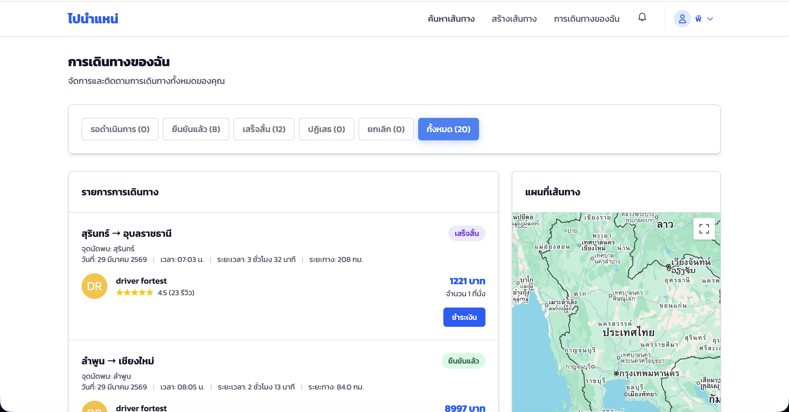

---

### 0.4 Modal เลือกวิธีชำระเงิน — โอนเงิน (Passenger)
Passenger เห็นข้อมูลการชำระเงินและเลือกวิธี **โอนเงิน (PromptPay)**

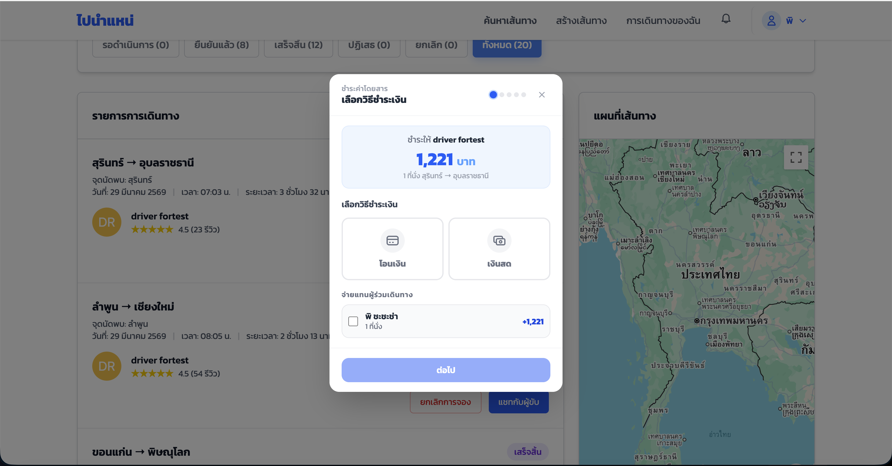

---

### 0.5 Modal เลือกวิธีชำระเงิน — เงินสด (Passenger)
Passenger เลือกวิธีชำระเงิน **เงินสด (Cash)**

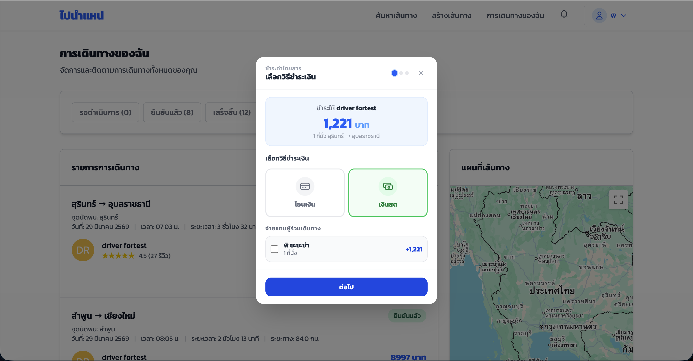

---

### 0.6 Modal อัปโหลดสลิป (Passenger)
กรณีเลือกโอนเงิน Passenger อัปโหลดสลิปการโอน

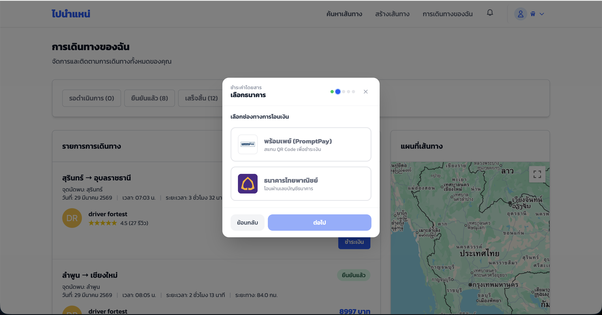

---

### 0.7 Modal ยืนยันการชำระ — โอนเงิน (Passenger)
สรุปข้อมูลก่อนกด **ยืนยันการชำระเงิน**

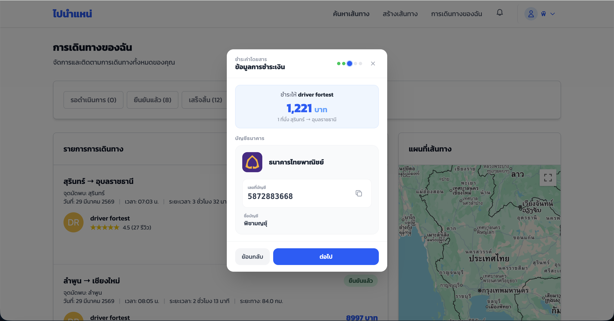

---

### 0.8 Modal ยืนยันการชำระ — เงินสด (Passenger)
สรุปยอดเงินสดที่ต้องชำระให้ Driver

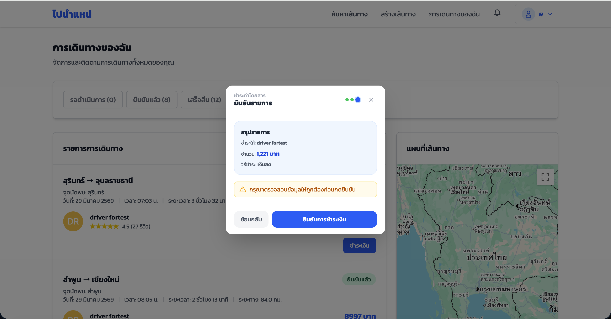

---

### 0.9 สถานะหลังส่งสลิป (Passenger)
แสดงสถานะ **รอคนขับยืนยัน** หลังจาก Passenger ส่งสลิปเรียบร้อย

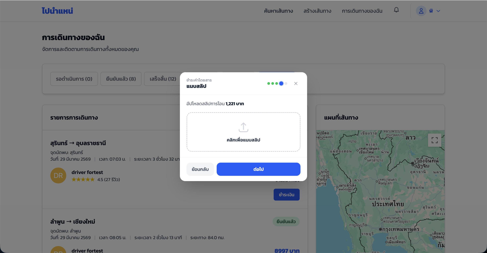

---

### 0.10 My Route หลังชำระเงิน (Passenger)
แสดงสถานะการชำระเงินในหน้า My Route หลังดำเนินการเสร็จ

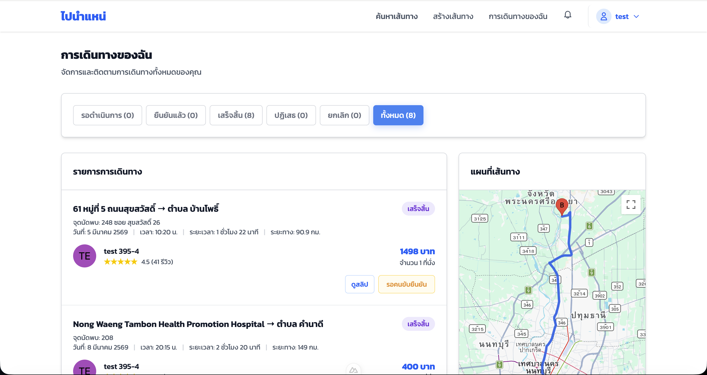

---

### 0.11 Modal ตรวจสอบการชำระเงิน (Driver)
Driver เห็นสลิปและข้อมูลการชำระของ Passenger พร้อมปุ่มยืนยัน/ปฏิเสธ

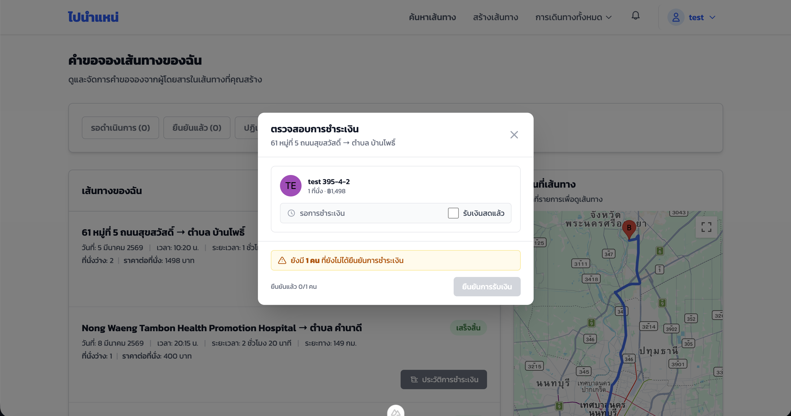

---

### 0.12 การยืนยันการชำระเงิน (Driver)
Driver กดยืนยันหลังตรวจสอบสลิปเรียบร้อย

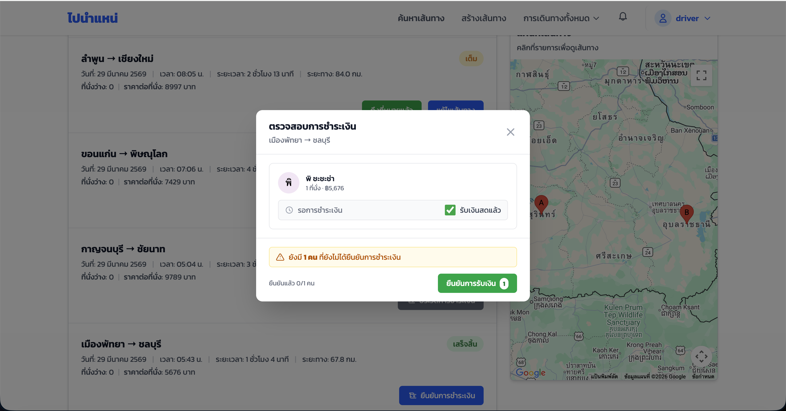

---

### 0.13 Dialog ปฏิเสธการชำระเงิน (Driver)
Driver กดปฏิเสธและเลือกเหตุผล

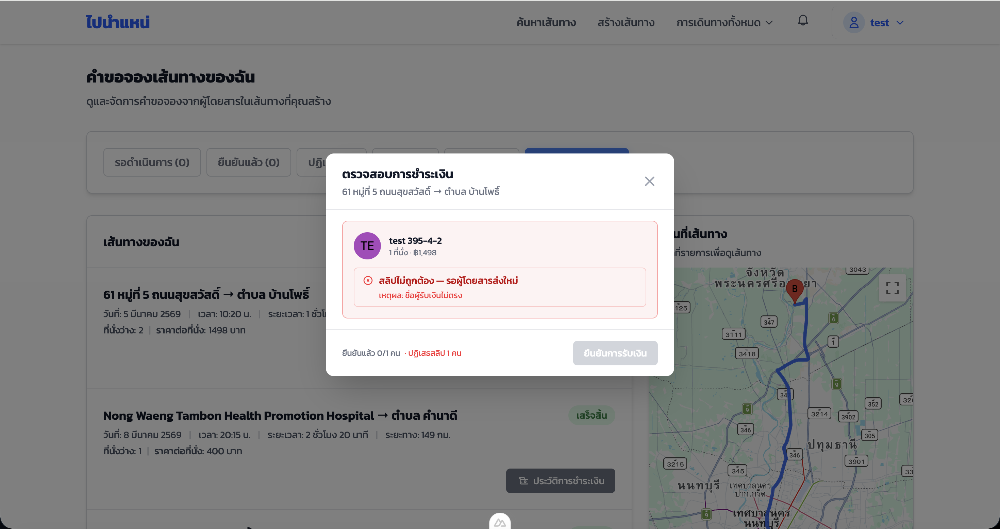

---

### 0.14 Dialog ระบุเหตุผลปฏิเสธ (Driver)
Driver ระบุเหตุผลเพิ่มเติมก่อนยืนยันการปฏิเสธ

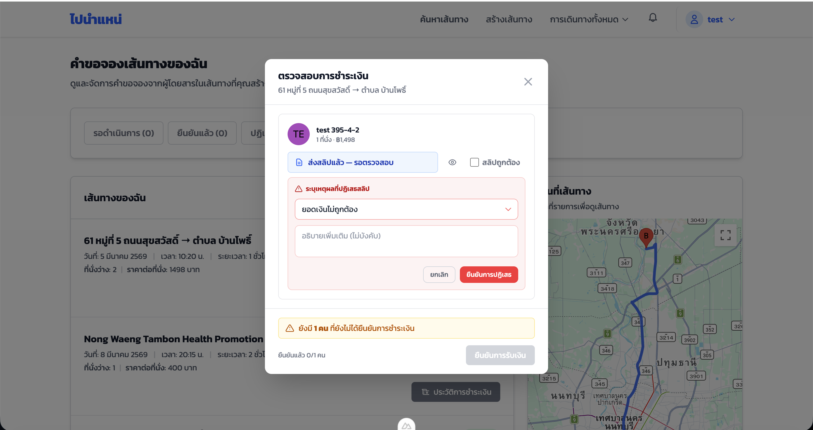

---

## 1. ขั้นตอนการใช้งาน

---

### กรณีที่ 1: Driver ตั้งค่าข้อมูลรับเงิน

| ขั้นตอน | การกระทำ |
|---------|---------|
| 1 | Login เข้าสู่ระบบในฐานะ Driver |
| 2 | ไปที่เมนู **โปรไฟล์** → **ข้อมูลการรับเงิน** |
| 3 | กรอก **PromptPay ID** (เบอร์มือถือ 10 หลัก หรือเลขบัตรประชาชน 13 หลัก) |
| 4 | กดปุ่ม **เพิ่มบัญชีธนาคาร** เลือกธนาคาร กรอกเลขบัญชีและชื่อบัญชี |
| 5 | กดปุ่ม **บันทึก** |

> **หมายเหตุ:** ข้อมูลนี้จะแสดงให้ Passenger เห็นเมื่อถึงเวลาชำระเงิน

---

### กรณีที่ 2: Passenger ชำระเงินด้วยการโอนเงิน (PromptPay)

| ขั้นตอน | การกระทำ |
|---------|---------|
| 1 | Driver กดปุ่ม **ถึงที่หมายแล้ว** ในหน้า My Route |
| 2 | Passenger เข้า **My Route** แล้วกดปุ่ม **ชำระเงิน** |
| 3 | Modal Step 1 เปิดขึ้น เลือกวิธีชำระ **โอนเงิน** |
| 4 | โอนเงินผ่าน PromptPay หรือแอปธนาคาร แล้วกด **ถัดไป** |
| 5 | Modal Step 2: อัปโหลดสลิป กด **ถัดไป** |
| 6 | Modal Step 3: ตรวจสอบข้อมูล กด **ยืนยันการชำระเงิน** |
| 7 | สถานะเปลี่ยนเป็น **รอคนขับยืนยัน** |

---

### กรณีที่ 3: Passenger ชำระเงินด้วยเงินสด

| ขั้นตอน | การกระทำ |
|---------|---------|
| 1 | Driver กดปุ่ม **ถึงที่หมายแล้ว** |
| 2 | Passenger เข้า **My Route** กดปุ่ม **ชำระเงิน** |
| 3 | Modal Step 1: เลือกวิธีชำระ **เงินสด** กด **ถัดไป** |
| 4 | Modal Step 3: ยืนยันการจ่ายเงินสดต่อ Driver โดยตรง กด **ยืนยัน** |
| 5 | สถานะเปลี่ยนเป็น **รออนุมัติ** (Driver ต้องกดยืนยันรับเงินสด) |

---

### กรณีที่ 4: Driver ตรวจสอบและยืนยันการชำระเงิน

| ขั้นตอน | การกระทำ |
|---------|---------|
| 1 | Driver ได้รับ Notification เมื่อ Passenger ส่งสลิปหรือแจ้งเงินสด |
| 2 | กดปุ่ม **ตรวจสอบการชำระเงิน** ใน My Route |
| 3 | Modal แสดงรายการ Passenger พร้อมสลิปหรือข้อมูลเงินสด |
| 4 | ตรวจสอบยอดเงิน ชื่อผู้โอน และวันเวลา |
| 5 | กดปุ่ม **ยืนยัน** — สถานะเปลี่ยนเป็น **ยืนยันแล้ว** |

---

### กรณีที่ 5: Driver ปฏิเสธการชำระเงิน

| ขั้นตอน | การกระทำ |
|---------|---------|
| 1 | ใน Modal ตรวจสอบ กดปุ่ม **ปฏิเสธ** |
| 2 | เลือก **เหตุผล** เช่น ยอดเงินไม่ถูกต้อง / รูปภาพไม่ชัดเจน / สลิปเก่า |
| 3 | กดปุ่ม **ยืนยันการปฏิเสธ** |
| 4 | ระบบแจ้ง Passenger พร้อมเหตุผล สถานะเปลี่ยนเป็น **ถูกปฏิเสธ** |

---

### สรุปสถานะการชำระเงิน

| สถานะ | ความหมาย |
|-------|---------|
| PENDING | รอ Passenger ชำระเงิน |
| SUBMITTED | Passenger ส่งสลิปแล้ว รอ Driver ตรวจสอบ |
| VERIFIED | Driver ยืนยันแล้ว การชำระเงินสมบูรณ์ |
| REJECTED | Driver ปฏิเสธสลิป รอ Passenger ส่งใหม่ |

---

## 2. คำชี้แจงการใช้ AI (PBI-Bonus)

ทีมพัฒนา PBI-Bonus มีการใช้เครื่องมือ AI เพื่อสนับสนุนกระบวนการพัฒนาระบบชำระเงิน โดยมีรายละเอียดดังนี้

| ชื่อ | ใช้ AI ตัวไหน | ใช้ในขั้นตอนไหน | ใช้เพื่ออะไร | ระดับ |
|---------|--------------|----------------|-------------|-------|
| pichamon395-4 | ChatGPT และ Claude | หาข้อมูลเกี่ยวกับใบเสร็จรับเสร็จ, วิเคราะห์ความถูกต้องของเอกสารที่จัดทำ ได้แก่ Test Data, วิเคราะห์ผล Newman test ที่ fail และระบุสาเหตุ, ตรวจสอบความสอดคล้องระหว่าง Test Design PDF กับ Postman Collection | เพิ่มความเร็วในการพัฒนาและลดข้อผิดพลาดในการทดสอบ | 2 |
| Thongchai595-6 | ChatGPT 5.2 | ใช้ในขั้นตอนการจัดทำ Code สำหรับ Test | ใช้ในการหาแหล่งข้อมูล Coding ต่างๆ เพื่อนำมาปรับใช้ในโปรเจค และช่วยตรวจสอบความถูกต้องในการเขียน เช่นเรื่อง format หรือจุดเล็กๆ เช่นลืมใส่ ; และช่วยตรวจ logic ของโค้ด | 2 |
| Ammika356-3 | Gemini | — | — | — |
| Bunyasak604-1 | ChatGPT (GPT-5) | — | — | — |
| Kittikorn587-5 | Gemini | ทำ frontend | ช่วย design ในหน้าที่ทำการแก้ไข | 2 |
| Jularat387-4 | Gemini | ในการเช็ค DOD | เพื่อเป็นตัวช่วยลิสรายการที่ต้องจัดการ | 1 |
| Siwawit402-3 | Gemini | ในขั้นตอนการทำงาน | ใช้แก้คำพูดให้สละสลวยยิ่งขึ้น | 1 |

---
